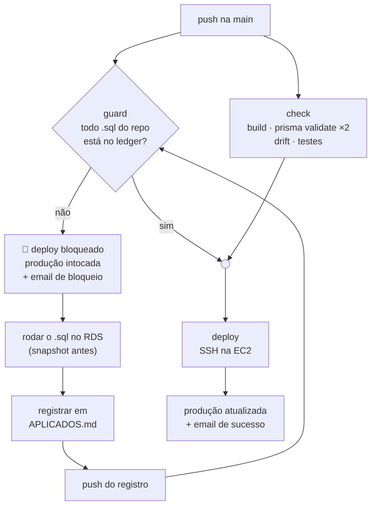

# Deploy

Este documento descreve como o código chega em produção e, principalmente, o mecanismo que impede que ele chegue **antes** do SQL de que depende. Serve para quem vai fazer um deploy, especialmente um que envolva mudança de banco.

Para os modelos de domínio, ver [docs/ARQUITETURA.md](docs/ARQUITETURA.md).

---

## Índice

- [Visão geral do pipeline](#visão-geral-do-pipeline)
- [Os workflows](#os-workflows)
- [SQL manual e o guard](#sql-manual-e-o-guard)
- [Ritual de uma mudança de schema](#ritual-de-uma-mudança-de-schema)
- [Liberação pontual](#liberação-pontual)
- [Secrets](#secrets)
- [Segurança da chave SSH](#segurança-da-chave-ssh)
- [Rollback](#rollback)
- [Deploy manual](#deploy-manual)

---

## Visão geral do pipeline

Todo push na branch `main` dispara o deploy automático em produção (AWS EC2 + RDS MySQL).



Os jobs `guard` e `check` rodam **em paralelo**; `deploy` depende dos dois. Nenhum dos dois toca a EC2 — ambos executam no runner do GitHub.

---

## Os workflows

### `deploy.yml` — Deploy para Produção (EC2)

Dispara em push na `main` e, manualmente, via `workflow_dispatch`. Tem `concurrency` configurada para que dois deploys nunca rodem ao mesmo tempo.

| Job | O que faz |
|---|---|
| **`guard`** | Executa `backend/scripts/guard-sql-pendente.mjs`. Exit 1 trava o pipeline |
| **`check`** | Build do frontend, `prisma validate` nos dois schemas, verificação de drift entre eles, e a suíte de testes do backend (`npm test -w backend`) |
| **`deploy`** | Depende de `guard` **e** `check`. Conecta na EC2 por SSH e executa o comando de deploy |

O comando executado na EC2:

```bash
cd /var/www/estoque-premium \
  && git pull origin main \
  && cd frontend && npm run build \
  && cd ../backend && npx prisma generate --schema=prisma/schema.mysql.prisma \
  && pm2 restart estoque-premium
```

Note que **não há `prisma migrate`**. O Prisma apenas regenera o client; nenhuma alteração estrutural é aplicada ao banco.

Ao final, um email é enviado: em sucesso, com hash do commit, autor e horário; em falha, com link direto para os logs do run.

### `ci-cd.yml` — Frontend CI (minimal)

Roda em push e pull request nas branches `main`, `develop` e `feature/*`. Faz apenas o build do frontend com Vite — é uma verificação rápida de que o bundle compila. A suíte de testes roda no job `check` do `deploy.yml`.

### Verificação de drift entre schemas

O script `backend/scripts/check-schema-drift.mjs` compara `schema.prisma` (SQLite) e `schema.mysql.prisma` (MySQL) e falha o build quando um model ou campo existe em um e não no outro. Diferenças intencionais — tipos, atributos `@db.*` e blocos `enum` — são ignoradas. Ver [docs/ARQUITETURA.md](docs/ARQUITETURA.md#dual-schema-sqlite-e-mysql).

---

## SQL manual e o guard

### Por que existe

O Prisma não roda migration no deploy. O `schema.mysql.prisma` **descreve** o RDS, mas não o altera: toda mudança estrutural exige DDL escrito à mão e aplicado manualmente no banco de produção.

Isso cria uma ordem obrigatória — **SQL no RDS primeiro, código depois**. No início do projeto essa ordem era apenas disciplina manual, e a produção caiu quando um push levou código que referenciava uma coluna ainda inexistente. O guard transforma a disciplina em regra do pipeline.

### Como o gate funciona

O guard **não** pergunta "este push traz SQL novo?". Ele pergunta:

> Existe, no repositório, algum `.sql` que ainda não foi registrado como aplicado?

Se existir, **todo** deploy fica travado — inclusive pushes que não têm nada a ver com banco.

A pergunta anterior, baseada no diff do push, tinha um furo comprovado:

```text
push 1: adiciona 2026-08-03-parcelas.sql + código   → guard BLOQUEIA  ✅
push 2: qualquer outra coisa, sem .sql no range     → guard LIBERA    ❌
         └─ e o deploy leva o HEAD, que CONTÉM o código do push 1,
            com o .sql ainda não aplicado no RDS.
```

Ancorar o gate no **estado** do repositório, e não no diff, fecha esse caminho.

Como consequência de desenho, o [`backend/prisma/sql/APLICADOS.md`](backend/prisma/sql/APLICADOS.md) deixou de ser memória e passou a ser o **registro de cobertura que destrava o pipeline**. Esquecer de registrar não é mais um detalhe de documentação: trava o próximo deploy.

O ledger documenta o próprio formato e mantém a tabela de arquivos já aplicados. Este documento não o duplica.

### Onde o guard procura

| Caminho | Papel |
|---|---|
| `backend/prisma/sql/` | DDL manual (convenção `AAAA-MM-DD-descricao.sql`) |
| `backend/prisma/manual/` | DDL manual (convenção mais antiga) |
| `backend/prisma/migrations/` | **Ignorado** — são migrations do SQLite de desenvolvimento, aplicadas por `prisma migrate`, e não tocam o RDS |

A leitura do ledger é deliberadamente restrita: o guard lê **apenas a primeira célula das linhas de tabela markdown**, a coluna `Arquivo`. Não varre o texto atrás de `*.sql`, porque uma menção em prosa — "ainda não rodei o X.sql" — passaria a valer como registro. Um guard não pode ser destravado por uma frase solta.

### Gatilho secundário: schema alterado sem SQL

Existe um segundo bloqueio, esse sim baseado no range do push: se o push altera `backend/prisma/schema.mysql.prisma` **e não adiciona nenhum `.sql`**, o deploy trava.

Ele cobre o esquecimento puro — sem arquivo `.sql`, o gate de cobertura não teria o que verificar. Permanece por range porque não existe estado que responda "o `schema.mysql.prisma` bate com o RDS?"; só a intenção do push.

Duas precisões na condição:

- Só dispara quando o push **não** trouxe `.sql`. Trazer schema, DDL e a linha do ledger num push só é o ritual correto, e quem decide ali é o gate de cobertura.
- Conta apenas arquivo **adicionado ou renomeado**, não modificado. Editar um `.sql` já registrado muda o DDL sem mudar o nome, e o gate de cobertura não veria diferença — nesse caso o gatilho continuar disparando é o comportamento seguro.

Esse gatilho não roda em `workflow_dispatch`, onde a liberação já é consciente.

---

## Ritual de uma mudança de schema

O caminho completo, do primeiro commit à produção atualizada:

**1. Escrever o DDL e o código juntos.**

```sql
-- backend/prisma/sql/2026-08-03-parcelas-pedido-som.sql
ALTER TABLE pedido_som ADD COLUMN parcelas INT NULL;
```

Atualizar **os dois** schemas Prisma — o de produção e o de desenvolvimento —, senão a verificação de drift falha o job `check`.

**2. `git push`.** O guard **trava o deploy**. Isso é o esperado, não um erro. A produção segue na versão anterior e um email de bloqueio é enviado, nomeando o arquivo pendente.

**3. Rodar o `.sql` no RDS.** Tirar snapshot do banco antes. Verificar o resultado — que a coluna existe, com o tipo e a nulidade certos.

**4. Registrar no ledger e fazer push.** Uma linha por arquivo em [`backend/prisma/sql/APLICADOS.md`](backend/prisma/sql/APLICADOS.md):

```markdown
| backend/prisma/sql/2026-08-03-parcelas-pedido-som.sql | 03/08/2026 | Nome | DDL: ALTER TABLE... Verificado: coluna existe, int, nullable. |
```

O deploy **destrava sozinho** nesse push.

O preenchimento é manual de propósito. Um append automático seria escrito no mesmo commit do `.sql`, antes de o SQL ter rodado — viraria reflexo e daria falsa sensação de segurança. A linha só é escrita por quem rodou.

---

## Liberação pontual

Quando o SQL já rodou no RDS mas o registro ainda não foi comitado, é possível liberar **aquele run** específico:

> **Actions → Deploy para Produção (EC2) → Run workflow →** preencher `sql_aplicado` com o nome do arquivo.

O nome informado precisa corresponder a um `.sql` **real** do repositório. Um valor genérico — `ok`, `sim`, `x` — é recusado, e essa recusa é o ponto: é o que separa confirmação consciente de reflexo.

A liberação vale só para aquele run. **O próximo push volta a travar** se a linha não estiver no ledger.

> Este mecanismo existe como input de workflow, e não como Environment com revisor obrigatório, porque o plano do repositório (Free + privado) não permite a regra de required reviewers. A vantagem incidental é que o input só existe **depois** do push: não dá para pré-armar num commit.

---

## Secrets

Cadastrar em **Settings → Secrets and variables → Actions**. Nunca versionar os valores.

| Secret | Conteúdo |
|---|---|
| `EC2_HOST` | IP ou hostname da EC2 de produção |
| `EC2_USER` | Usuário SSH usado no deploy |
| `EC2_SSH_KEY` | Chave privada SSH dedicada ao deploy (PEM completo) |
| `EC2_PORT` | Porta SSH (normalmente 22) |
| `SMTP_SERVER` | Servidor SMTP das notificações |
| `SMTP_PORT` | Porta do SMTP (465 ou 587) |
| `SMTP_USERNAME` | Usuário de autenticação, também usado como remetente |
| `SMTP_PASSWORD` | Senha ou app password do SMTP |
| `MAIL_TO` | Destinatários das notificações (vírgula separa vários) |

---

## Segurança da chave SSH

A chave usada pelo workflow é restrita por **forced command** no `authorized_keys` da EC2: independentemente do que a conexão envie, ela só executa o comando de deploy. Não abre shell interativo nem executa nada além disso.

Se a chave vazar, o dano fica limitado a disparar um deploy.

Como consequência, **a chave do CI não serve para acesso manual** à máquina — use uma chave pessoal.

---

## Rollback

Em caso de falha, o email de bloqueio ou de erro traz o link dos logs.

1. Ler os logs do run no GitHub Actions para identificar a causa.
2. Se o problema for um commit ruim na `main`, reverter com `git revert <hash>` e fazer push. O próprio push do revert dispara um novo deploy com o código anterior.
3. Conferir o estado do processo na EC2:

   ```bash
   pm2 status estoque-premium
   pm2 logs estoque-premium
   ```

> **Reverter código não reverte SQL.** Um `git revert` desfaz o commit, mas o DDL já aplicado ao RDS continua lá. Em geral isso é inofensivo — uma coluna a mais não quebra código antigo —, mas o inverso não é: voltar para uma versão anterior a uma remoção de coluna quebra. Avaliar caso a caso antes de reverter migração destrutiva.

---

## Deploy manual

Só necessário se o pipeline estiver indisponível. Requer chave pessoal na EC2.

```bash
cd /var/www/estoque-premium \
  && git pull origin main \
  && cd frontend && npm run build \
  && cd ../backend && npx prisma generate --schema=prisma/schema.mysql.prisma \
  && pm2 restart estoque-premium
```

> ⚠️ O deploy manual **contorna o guard**. Antes de rodá-lo, confirmar que todo `.sql` do repositório já foi aplicado no RDS.

### Configuração de referência

**Backend.** Variáveis sensíveis em `backend/.env` (ver `backend/.env.example`). Instalar com `npm install` e iniciar com `npm start` ou process manager. `npm run seed` garante que o usuário admin existe.

**Frontend.** Configurar `VITE_API_URL` em `frontend/.env`. Sem essa variável, o cliente tenta `https://<domínio>/api` e, por último, `http://localhost:3000/api`. O build (`npm run build`) gera `frontend/dist/`, que pode ser servido por qualquer host estático. Servindo o backend no mesmo domínio com proxy em `/api`, não é preciso alterar o frontend.
