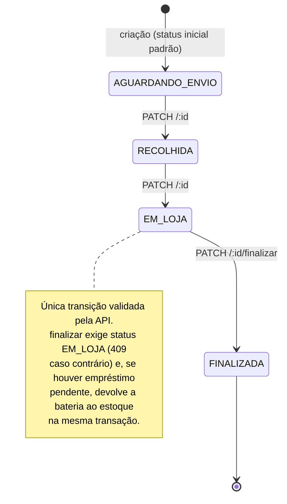

# Arquitetura

Este documento descreve os modelos de domínio do Estoque Premium: como o sistema separa as duas linhas de produto, como as permissões são compostas, como a comissão é apurada e por que certos dados, uma vez gravados, nunca são recalculados. Serve como leitura de contexto antes de mexer em qualquer código que toque estoque, dinheiro ou permissão.

Para o ciclo de edição de vendas, ver [EDICAO_DE_VENDAS.md](EDICAO_DE_VENDAS.md). Para os endpoints de agregação, ver [DASHBOARD.md](DASHBOARD.md).

---

## Índice

- [Visão geral](#visão-geral)
- [As duas linhas de produto](#as-duas-linhas-de-produto)
- [Modelo de permissões](#modelo-de-permissões)
- [Sanitização por permissão](#sanitização-por-permissão)
- [Estoque como agregado](#estoque-como-agregado)
- [Comissão](#comissão)
- [Snapshots congelados](#snapshots-congelados)
- [Auditoria de vendas](#auditoria-de-vendas)
- [Garantias](#garantias)
- [Dual schema: SQLite e MySQL](#dual-schema-sqlite-e-mysql)

---

## Visão geral

```text
estoque-premium/
├── frontend/                 SPA React + Vite
└── backend/                  API Express (ESM) + Prisma
    ├── src/
    │   ├── routes/           um router por recurso
    │   ├── services/         regras compartilhadas por mais de uma rota
    │   ├── schemas/          validação Zod de body/query/params
    │   ├── middlewares/      autenticação, escopo de linha, validação
    │   └── utils/            regras puras (comissão, estorno, preços, paginação)
    └── prisma/
        ├── schema.prisma          SQLite (desenvolvimento)
        ├── schema.mysql.prisma    MySQL / RDS (produção)
        └── sql/                   DDL manual aplicado à mão no RDS
```

Uma convenção atravessa o backend: **regra que mais de uma rota usa não vive dentro de rota**. Quando a apuração de vendas passou a servir duas rotas, a conta foi para `services/vendasResumo.js`; quando o estorno de estoque passou a servir três, foi para `utils/estorno.js`. O motivo é sempre o mesmo — duas cópias de uma regra de dinheiro divergem na primeira correção que só uma delas recebe.

---

## As duas linhas de produto

O sistema opera **duas linhas** independentes: **Baterias** e **Som**. Cada uma tem catálogo, movimentações e telas próprias. "Linha" é o termo usado em todo o código e nesta documentação; não há sinônimo.

| Conceito | Baterias | Som |
|---|---|---|
| Catálogo | `estoque` | `estoque_som` |
| Movimentação de estoque | `movimentacoes` | `movimentacoes_som` |
| Registro de venda | a própria movimentação de `SAIDA` | `pedido_som` (+ `pedido_som_item`) |
| Serviço / mão de obra | não se aplica | `classe_som` define o valor por tipo de serviço |
| Comissão | valor fixo por unidade | percentual sobre a mão de obra |

A diferença estrutural mais importante está na terceira linha da tabela. **Em Baterias, a movimentação é a venda.** Em Som, a venda é o `pedido_som`, e as `movimentacoes_som` que ele gera são apenas a baixa de estoque — contá-las como receita dobraria o faturamento.

Esse vínculo entre pedido e movimentação é **por string**, não por chave estrangeira: as movimentações geradas por um pedido gravam `motivo = 'Pedido Som #<id>'`. Não existe coluna ligando um `pedido_som_item` à movimentação que ele produziu, o que tem consequência direta na edição de pedidos (ver [EDICAO_DE_VENDAS.md](EDICAO_DE_VENDAS.md#estorna-e-reaplica)).

---

## Modelo de permissões

O acesso é composto por **três eixos independentes**, todos resolvidos no servidor.

### 1. Papel

`user.role` assume `admin` ou `user`. **Admin ignora todos os outros eixos.** Telas administrativas — cadastro de produto, classes de serviço, configuração de comissão, gestão de usuários — são restritas a `admin` e não aparecem como permissão granular.

### 2. Módulos de tela

Onze chaves booleanas cobrem as telas operacionais, definidas em [`backend/src/utils/permissoes.js`](../backend/src/utils/permissoes.js):

```javascript
export const PERMISSOES_MODULOS = [
  'home', 'estoque_baterias', 'estoque_som', 'orcamento', 'tabela_precos',
  'entrada_saida', 'reg_movimentacao', 'dashboards', 'garantia',
  'consulta_garantia', 'emprestimos',
];
```

### 3. Linha de produto

`linha_baterias` e `linha_som` formam um eixo **ortogonal** aos módulos. O acesso efetivo a uma tela de linha é a conjunção dos dois:

> **acesso = permissão do módulo E linha correspondente**

A linha é o teto. Sem `linha_som`, a linha Som desaparece de tudo — inclusive de telas cujo módulo está marcado.

Fora desses eixos há uma flag independente, `ver_custo`, que libera preço de custo e qualquer valor derivado dele dentro de qualquer tela a que o usuário já tenha acesso.

### Armazenamento

Todas as chaves ficam num único JSON de booleanos em `user.permissoes`. **Chave ausente equivale a `false`.** O parse é defensivo — nunca lança, nunca devolve algo que não seja objeto.

```json
{ "home": true, "estoque_som": true, "reg_movimentacao": true, "linha_som": true }
```

O usuário acima opera apenas a linha Som e não vê custo.

### Onde o escopo é aplicado

Sete routers declaram a linha no momento do mount, em [`backend/src/app.js`](../backend/src/app.js):

```javascript
app.use('/api/estoque',      requireAuth, requireLinha('baterias'), estoqueRouter);
app.use('/api/pedido-som',   requireAuth, requireLinha('som'),      pedidoSomRouter);
```

Três routers **não** podem fazer isso, e a exceção é deliberada:

| Router | Por que o escopo é resolvido por request |
|---|---|
| `/api/inventario` | A linha vem no path (`/inventario/som/historico`). Com `requireLinha` no mount, a conferência de Som de um usuário som-only quebraria |
| `/api/estoque-resumo` | Serve as duas linhas num payload só. A linha fora do escopo retorna `null` e não entra no total |
| `/api/vendas-resumo` | Mesmo desenho, para o dashboard Baterias/Som/Ambos |

O espelho da lista de permissões existe em `frontend/src/utils/permissoes.js` apenas para montar a interface. **O gate real é sempre o servidor** — esconder um botão no front é cosmético.

---

## Sanitização por permissão

Não basta bloquear rotas: um payload legítimo pode carregar campo que aquele usuário não pode ver. Dois sanitizadores atuam na resposta.

| Função | Onde | Remove de quem não tem permissão |
|---|---|---|
| `sanitizeCusto` | `utils/permissoes.js` | `custo`, `percentual_lucro` (sem `ver_custo`) |
| `sanitizePedidoComissao` | `routes/pedidoSom.routes.js` | `comissao_joel`, `valor_mao_obra`, `valor_mao_obra_insulfilme` e, **por item**, `mao_obra_unit`, `mao_obra_total` e `percentual_comissao` (sem `role=admin`) |

A parte por item do segundo sanitizador merece destaque: somar `itens[].mao_obra_total` reconstrói `valor_mao_obra` inteiro. Limpar só o cabeçalho deixaria a base da comissão visível para qualquer usuário com a linha Som.

---

## Estoque como agregado

O saldo não é uma coluna escrita pelo aplicativo. Ele é derivado de três acumuladores:

```text
em_estoque = qtd_inicial + entradas − saidas
```

No MySQL, `em_estoque` é **coluna gerada** e nunca recebe escrita. No SQLite de desenvolvimento a coluna pode vir nula, e o código calcula o valor a partir dos três campos. Todo helper que lê saldo trata os dois casos.

### Escrita atômica

Alterações nos acumuladores usam operadores atômicos do Prisma, que compilam para aritmética no próprio SQL:

```javascript
// Correto: SET saidas = saidas + n, resolvido pelo banco sob lock de linha
await tx.estoque.update({ where: { id }, data: { saidas: { increment: n } } });

// Incorreto: lê num momento e escreve noutro — duas vendas simultâneas do
// mesmo produto perdem um dos incrementos (lost update)
await tx.estoque.update({ where: { id }, data: { saidas: (prod.saidas ?? 0) + n } });
```

### Estorno que falha em vez de truncar

Desfazer uma movimentação usa `dadosEstorno`, em [`backend/src/utils/estorno.js`](../backend/src/utils/estorno.js). Quando o estorno não cabe no acumulado atual — sinal de que os dados já estavam inconsistentes —, a função **lança com status 409** e a transação inteira sofre rollback. A alternativa anterior, truncar em zero, gravava um estoque errado e respondia sucesso.

---

## Comissão

A comissão é apurada por **quinzena**: dia 1 a 15, e dia 16 até o último dia do mês. Existem **dois modelos de remuneração**, com bases e fontes de dados diferentes.

### Fuso horário

O corte da quinzena é ancorado em **horário de Brasília**, não no fuso do servidor. Isso é decisivo porque comissão é dinheiro: uma venda às 23h30 (BRT) do dia 15 precisa cair na primeira quinzena mesmo com o servidor rodando em UTC, onde já seria dia 16. São Paulo é fixo em UTC−3 desde 2019, então o código usa o offset literal `-03:00` para construir instantes exatos.

`periodoDe(date)` devolve `{ inicio, fim, proximoInicio }`. As queries usam `>= inicio` e `< proximoInicio` — limite superior exclusivo, para não depender do último milissegundo.

### Modelo 1 — Baterias: valor fixo por unidade

Os vendedores elegíveis estão em uma constante, `VENDEDORES_BATERIA`, e a apuração casa o nome por **igualdade exata**. Cada unidade vendida vale um valor fixo em reais.

```javascript
const grupos = await client.movimentacoes.groupBy({
  by: ['vendedor'],
  where: {
    tipo: 'SAIDA',
    garantia_id: null,                        // empréstimo não é venda
    vendedor: { in: VENDEDORES_BATERIA },
    data_movimentacao: { gte: inicio, lt: proximoInicio },
  },
  _sum: { quantidade: true },
});
// comissão = Σ quantidade × config.valor_bateria
```

Três detalhes com consequência prática:

1. **O produto não influi.** A comissão é por unidade, independentemente de qual bateria foi vendida.
2. **Empréstimo de garantia fica fora** (`garantia_id: null`). Não é venda.
3. **A igualdade é exata.** Um nome com caixa ou espaçamento diferente do valor da constante remove a venda da comissão sem gerar erro. Por isso a edição de venda valida o vendedor contra um enum, mesmo que a criação aceite texto livre — ver [EDICAO_DE_VENDAS.md](EDICAO_DE_VENDAS.md#trocar-o-vendedor).

### Modelo 2 — Som: percentual sobre a mão de obra

> ⚠️ **DESATUALIZADO (17/08/2026).** Esta seção descreve o modelo de dois baldes
> (SOM/INSULFILME), encerrado quando a comissão passou a somar a % gravada em
> cada `pedido_som_item.percentual_comissao`. `classe_som` foi removida e
> `valor_mao_obra_insulfilme` deixou de ser escrito. Reescrever pendente.

A base é a mão de obra dos pedidos de instalação do período, dividida em duas categorias com percentuais distintos:

```javascript
const agg = await client.pedido_som.aggregate({
  _sum: { valor_mao_obra: true, valor_mao_obra_insulfilme: true },
  where: { created_at: { gte: inicio, lt: proximoInicio } },
});

const baseInsulfilme = Number(agg._sum.valor_mao_obra_insulfilme || 0);
const baseSom        = Number(agg._sum.valor_mao_obra || 0) - baseInsulfilme;

// comissão = baseSom × pctSom/100 + baseInsulfilme × pctInsulfilme/100
```

`valor_mao_obra` é o **total**; `valor_mao_obra_insulfilme` é a **porção** dele referente a Insulfilme. A base de Som é a diferença entre os dois — nunca a soma.

> #### Premissa: um único instalador
>
> A apuração de Som **não filtra por vendedor**. Ela soma toda a mão de obra do período e atribui integralmente ao instalador definido em `VENDEDOR_MAO_OBRA`. Isso é intencional e reflete a operação atual da loja: **há um único instalador**.
>
> **O que quebraria se um segundo instalador entrasse:** a comissão do primeiro passaria a incluir o trabalho do segundo, silenciosamente — sem erro, sem aviso, e sem nada no banco que permita separar depois. `pedido_som` **não tem coluna de vendedor/instalador**. Suportar dois instaladores exige, no mínimo: uma coluna nova em `pedido_som`, backfill dos pedidos existentes, filtro na apuração e um campo na tela de criação de pedido. Nenhuma dessas peças existe hoje.

### Configuração

`comissao_config` é um singleton criado sob demanda, com padrões embutidos no código (`valor_bateria` R$ 15,00; `percentual_mao_obra` 30%; `percentual_insulfilme` 25%). Criar sob demanda evita depender de o seed rodar no deploy.

### Fechamento preguiçoso

Não existe cron. `fecharPeriodosPendentes()` roda **ao acessar** `/api/comissao/painel` e fecha todo período anterior ao atual que ainda não tenha snapshot. A função é idempotente: para no primeiro período já fechado, porque o fechamento é contíguo. Na primeira execução faz backfill até a data mais antiga com movimentação ou pedido, com uma trava de 260 iterações (cerca de dez anos de quinzenas) contra loop infinito.

**Consequência operacional:** existe uma janela entre o fim de uma quinzena e o instante em que ela é efetivamente fechada. Um período que terminou no dia 31 pode ser fechado só no dia 3, quando alguém abrir o painel. Edições feitas nessa janela **entram** no snapshot — o que torna `fechado_at` o campo correto para qualquer verificação de "isto foi editado depois de pago", e não a mera existência do registro.

---

## Snapshots congelados

Três estruturas guardam retratos de um momento e **nunca são recalculadas**. Isso não é omissão: recalcular apagaria a diferença entre o que foi decidido e o que é verdade hoje.

| Estrutura | Congela | Por que não recalcula |
|---|---|---|
| `comissao_periodo` + `comissao_periodo_item` | Comissão apurada e paga na quinzena | Recalcular reescreveria o valor de um pagamento já feito |
| `conferencia_item.qtd_sistema` | Saldo do sistema na abertura da conferência | O objetivo é comparar contagem física contra o que o sistema dizia **naquele momento** |
| `venda_auditoria.conteudo_anterior` | Estado da venda antes de uma edição ou exclusão | É um diário; um diário reescrito não é diário |

### `comissao_periodo_item`

Cada item guarda a base, o valor apurado e — importante — a **configuração vigente no fechamento**:

| Campo | Conteúdo |
|---|---|
| `qtd_baterias` | Unidades vendidas no período |
| `base_mao_obra` | Base de Som (já descontado o Insulfilme) |
| `base_insulfilme` | Base de Insulfilme |
| `valor_comissao` | Valor apurado |
| `snap_valor_bateria` | R$ por bateria vigente no fechamento |
| `snap_percentual` | % de Som vigente no fechamento |
| `snap_percentual_insulfilme` | % de Insulfilme vigente no fechamento |

Os campos `snap_*` são o que permite reconstruir a conta anos depois, mesmo que a configuração mude. Qualquer cálculo sobre um período fechado deve usá-los, **nunca** a `comissao_config` atual.

> **Campo `tipo`:** a função `apurar()` devolve `tipo: 'BATERIA' | 'MAO_OBRA'` em cada item, mas `comissao_periodo_item` **não tem essa coluna** — o campo existe apenas no cálculo ao vivo, para a interface distinguir os dois modelos, e é descartado ao persistir. O comportamento é correto: o tipo é derivável do próprio conteúdo (`qtd_baterias > 0` versus `base_mao_obra > 0`).

### Conferência de inventário

`conferencia_estoque` tem status `EM_ANDAMENTO` ou `FINALIZADA`. Na abertura, o sistema fotografa `qtd_sistema` de todos os produtos da linha em `conferencia_item`. Conferir um item grava `qtd_contada`; "bateu" grava um valor igual a `qtd_sistema`.

A janela entre abertura e finalização é sensível: qualquer movimentação de estoque nesse intervalo faz a divergência registrada culpar quem contou. Por isso as telas de edição avisam quando há conferência aberta na linha.

---

## Auditoria de vendas

`venda_auditoria` é um **diário append-only**: o aplicativo só insere, nunca atualiza nem apaga.

```javascript
{
  linha: 'baterias' | 'som',
  entidade: 'movimentacoes' | 'movimentacoes_som' | 'pedido_som',
  entidade_id: 42,
  acao: 'EXCLUSAO' | 'EDICAO',
  conteudo_anterior: '{"movimentacao":{...},"produto":{...}}',
  user_id: 1,
  feito_por: 'usuario@exemplo.com',
  feito_em: '2026-08-06T13:42:00.000Z',
}
```

Três decisões de desenho sustentam essa tabela:

**Tabela à parte, não soft-delete.** Um `deleted_at` na venda obrigaria todo leitor — dashboard, comissão, listagens — a filtrar, e esquecer um filtro faria número de dinheiro sair errado em silêncio. Append-only não muda leitor nenhum.

**`conteudo_anterior` é `String`/`LONGTEXT` nos dois schemas**, não `Json`. O SQLite de desenvolvimento não tem escalar JSON, e divergir os tipos criaria um bug invisível em produção. O custo é que não se pode filtrar por conteúdo no SQL — quem precisar analisar o diário lê as linhas e faz o parse na aplicação.

**A gravação recebe o `tx` da transação em curso**, nunca o cliente global. Se o log falhar, a operação inteira sofre rollback; se a operação falhar, o log some junto. Não existe "apagou mas não registrou" nem "registrou uma exclusão que não aconteceu".

---

## Garantias

Uma garantia acompanha um produto deixado para análise, e opcionalmente um **empréstimo**: uma bateria cedida ao cliente enquanto o produto está em garantia. Os dois eixos são independentes.

O empréstimo dá baixa no estoque através de uma movimentação real, com `garantia_id` preenchido e `motivo = 'Empréstimo garantia #<id>'`. Essa movimentação **não é uma venda** e está excluída de faturamento, de custo e de comissão. As rotas de exclusão e edição de venda a recusam explicitamente com status 409.

### Estados



> **A sequência acima é a ordem física do processo, não uma máquina de estados imposta pelo servidor.** `PATCH /api/garantias/:id` aceita qualquer valor do enum `['AGUARDANDO_ENVIO', 'RECOLHIDA', 'EM_LOJA', 'FINALIZADA']` sem verificar o estado anterior — é possível pular ou retroceder etapas. A **única** transição validada é `PATCH /:id/finalizar`, que exige `EM_LOJA`.

Na fase `EM_LOJA` a distribuidora informa o resultado do teste, gravado em `resultado` com os valores `NOVA` ou `MESMA`, mais um `laudo` em texto livre.

A exclusão de uma garantia é restrita a `admin` e reverte automaticamente qualquer empréstimo pendente na mesma transação — sem isso, a bateria emprestada sumiria do estoque e do registro ao mesmo tempo.

---

## Dual schema: SQLite e MySQL

O projeto mantém **dois schemas Prisma**:

| Arquivo | Ambiente | Uso |
|---|---|---|
| `prisma/schema.prisma` | Desenvolvimento e testes | SQLite, sem servidor de banco |
| `prisma/schema.mysql.prisma` | Produção | MySQL no RDS |

As diferenças **intencionais** entre eles são: tipos (`String` versus `enum`), atributos `@db.*` e os blocos `enum`, que só existem no MySQL. Qualquer outra divergência — um model ou campo presente em um e ausente no outro — é erro.

O script `backend/scripts/check-schema-drift.mjs` roda no pipeline e falha o build quando encontra essa divergência. Os detalhes do gate estão em [DEPLOY.md](../DEPLOY.md).

**O Prisma não executa migration em produção.** O `schema.mysql.prisma` *descreve* o RDS, mas não o altera: toda mudança estrutural exige DDL escrito à mão e aplicado manualmente. O processo completo, incluindo o guard que impede código de subir antes do SQL, está em [DEPLOY.md](../DEPLOY.md#sql-manual-e-o-guard).
